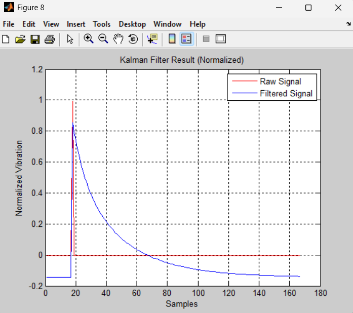
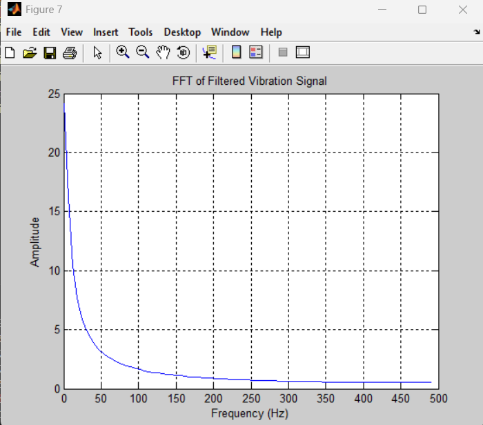
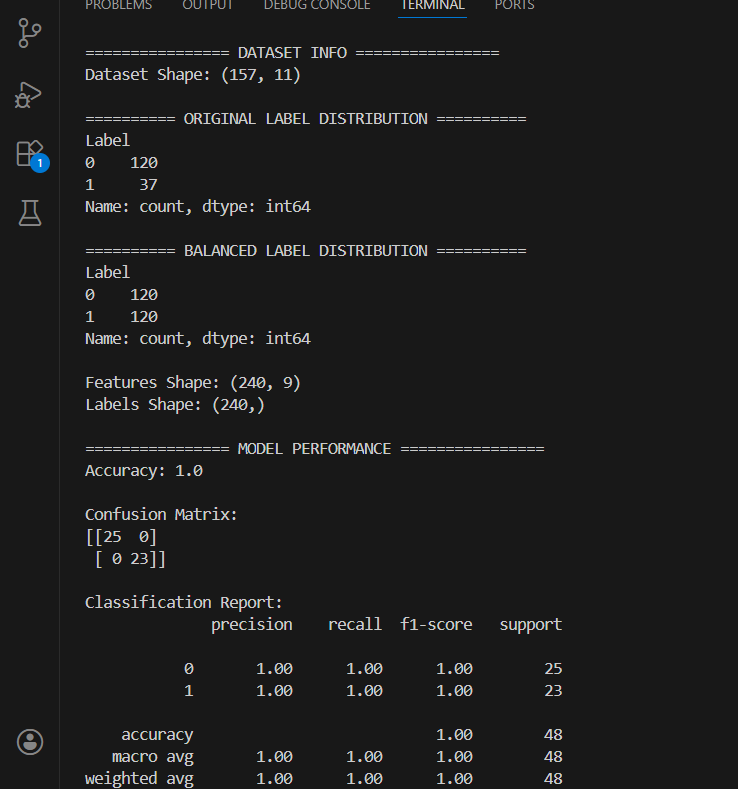
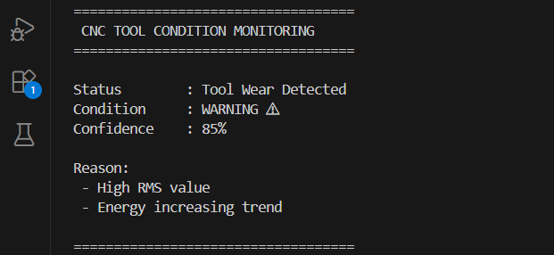
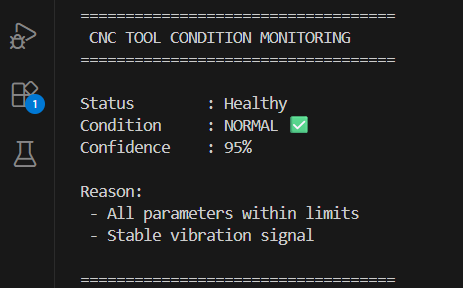

# Tool Wear Prediction System

## 🔍 Overview
This project was developed to study tool wear behavior using signal-based feature extraction and machine learning techniques. The objective was to understand how signal variations can indicate tool degradation in machining systems.

---

## 🏗️ System Architecture

---

## ⚙️ Methodology
- Signal data analysis (dataset-based)
- Signal preprocessing (filtering)
- Feature extraction:
  - RMS
  - Energy
  - Mean
- Machine learning model for classification

---

## 🔄 Project Flow
1. Signal acquisition (dataset-based)
2. Signal preprocessing
3. Feature extraction
4. Machine learning classification
5. Result visualization

---

## 📊 Results

### Kalman Filter Output

### FFT Analysis

### Signal Distribution

### Condition Classification (Case 1)

### Condition Classification (Case 2)

---

## 📁 Data
- Raw vibration data
- Filtered signal data
- Feature extracted dataset

---

## 🧠 Skills Demonstrated
- Signal processing fundamentals
- Feature engineering
- Machine learning application in engineering systems

---

## ⚠️ Note
This project uses dataset-based signal data for analysis. Future work includes implementing real-time data acquisition from CNC systems.
